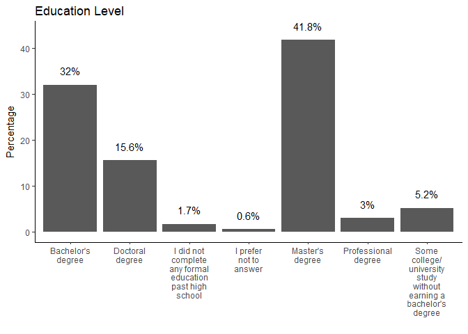
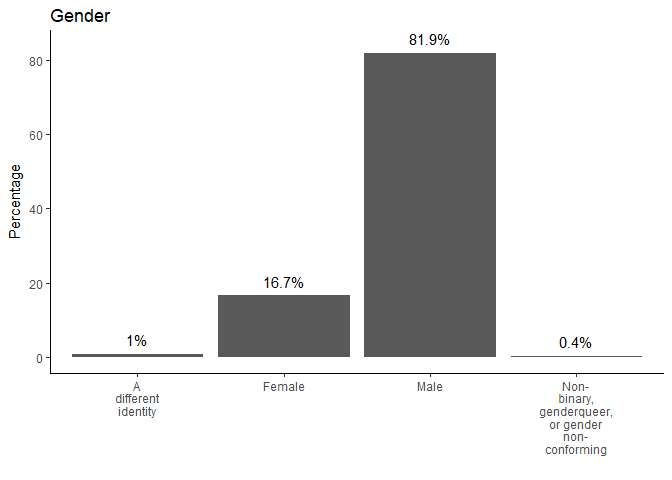
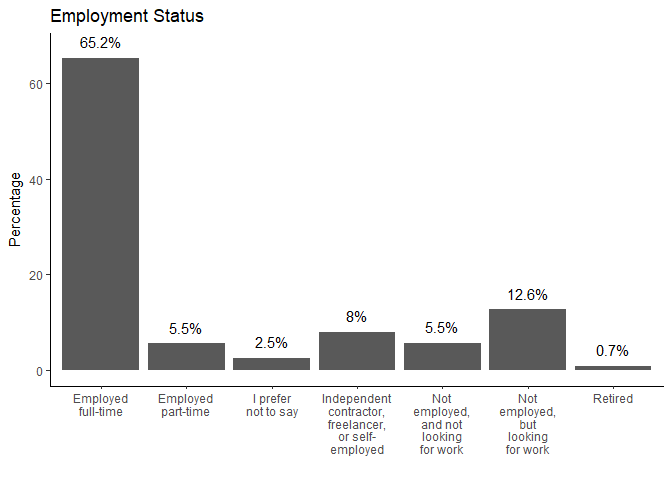
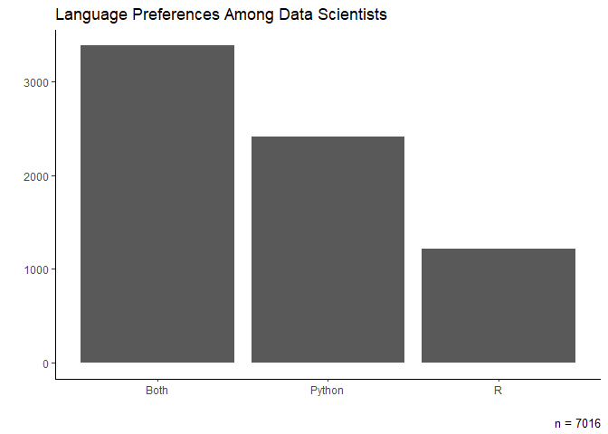
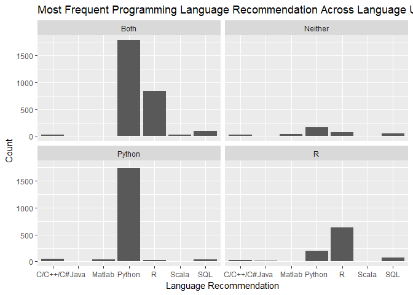
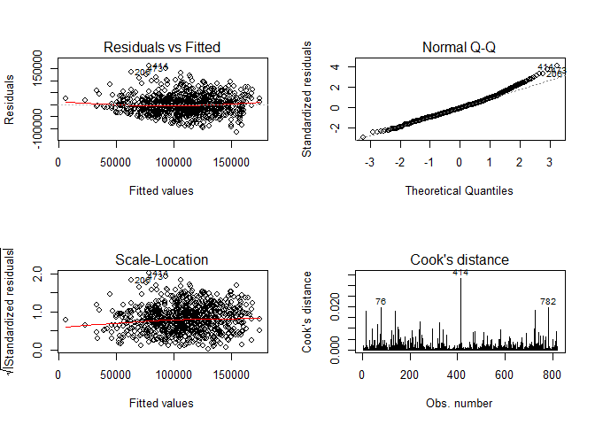

    #Load libraries
    library(tidyverse)
    library(knitr)
    library(forcats)

    #Import data
    responses <- read_csv("multipleChoiceResponses.csv")

Demographics
------------

    #Create function to plot simple factor/char variables
    plot_factor <- function(var, ttl){
      #Create dataset of percentages
      responses <- responses %>%
        filter(!is.na(get(var))) %>%
        group_by(get(var)) %>%
        summarise(n = n()) %>%
        mutate(pct = n/sum(n)*100)
      
      #plot percentages for each group
      ggplot(responses, aes(`get(var)`, pct), col = "purple")+
        geom_bar(stat = "identity")+
        geom_text(aes(label = paste0(round(pct,1), "%"), y = pct+2.0),vjust= -.1)+
        theme_classic()+
        scale_x_discrete(labels = function(x) str_wrap(x, width = 10))+
        labs(x = "", y = "Percentage", title = ttl)
        
    }

    # Create vector of variables of interest to iterate over
    kaggle_vars <- c("FormalEducation", "GenderSelect", "EmploymentStatus")
    # Vector of custom plot titles
    kaggle_titles <- c("Education Level", "Gender", "Employment Status")

    # Use map to iterate function over all variables of interest
    map2(kaggle_vars, kaggle_titles, plot_factor)

    ## [[1]]

    ## 
    ## [[2]]

    ## 
    ## [[3]]

What are the most fequently used data science tools?
----------------------------------------------------

    #Separate tools used by each participant by comma & unnest to create df of all occurences of each data science tool
    tools <- responses  %>% 
        select(WorkToolsSelect) %>%
        mutate(work_tools = strsplit(WorkToolsSelect, ",")) %>%
        unnest(work_tools)

    head(tools)

    ## # A tibble: 6 x 2
    ##                                                               WorkToolsSelect
    ##                                                                         <chr>
    ## 1            Amazon Web services,Oracle Data Mining/ Oracle R Enterprise,Perl
    ## 2            Amazon Web services,Oracle Data Mining/ Oracle R Enterprise,Perl
    ## 3            Amazon Web services,Oracle Data Mining/ Oracle R Enterprise,Perl
    ## 4                                                                        <NA>
    ## 5                                                                        <NA>
    ## 6 Amazon Machine Learning,Amazon Web services,Cloudera,Hadoop/Hive/Pig,Impala
    ## # ... with 1 more variables: work_tools <chr>

    #Create data frame of counts of each data science tool
    tool_count <- tools %>%
      filter(!is.na(work_tools)) %>%
      group_by(work_tools) %>% 
      summarise(n = n()) %>%
      arrange(desc(n))

    kable(head(tool_count), col.names = c("Program", "Count"))

<table>
<thead>
<tr class="header">
<th align="left">Program</th>
<th align="right">Count</th>
</tr>
</thead>
<tbody>
<tr class="odd">
<td align="left">Python</td>
<td align="right">6073</td>
</tr>
<tr class="even">
<td align="left">R</td>
<td align="right">4708</td>
</tr>
<tr class="odd">
<td align="left">SQL</td>
<td align="right">4261</td>
</tr>
<tr class="even">
<td align="left">Jupyter notebooks</td>
<td align="right">3206</td>
</tr>
<tr class="odd">
<td align="left">TensorFlow</td>
<td align="right">2256</td>
</tr>
<tr class="even">
<td align="left">Amazon Web services</td>
<td align="right">1868</td>
</tr>
</tbody>
</table>

The R vs. Python Debate
-----------------------

    debate_tools <- responses %>%
      filter(!is.na(WorkToolsSelect))

    # Creating a new column called language preference which identifies users who use only R, only Python, both, or neither
    debate_tools <- debate_tools  %>% 
       mutate(language_preference = case_when(
           grepl("R", WorkToolsSelect) & !grepl("Python", WorkToolsSelect) ~ "R",
           grepl("Python", WorkToolsSelect) & !grepl("R", WorkToolsSelect) ~"Python",
           grepl("Python,R", WorkToolsSelect) ~ "Both",
           !grepl("Python", WorkToolsSelect) & !grepl("R", WorkToolsSelect) ~ "Neither"))

    # Creating a new data frame
    debate_plot <- debate_tools

    # Grouping by language preference and calculate number of responses
    debate_plot <- debate_plot  %>% 
       group_by(language_preference)  %>% 
        summarise(n = n())  %>% 

    # Removing the row for users of "neither"
        filter(language_preference != "Neither")

    #Create chracter string indicating n value for plot caption
    plot_n <- paste("n =", sum(debate_plot$n))

    # Creating a bar chart
    ggplot(debate_plot, aes(language_preference, n))+
        geom_bar(stat = "identity")+
        labs(x = "", y = "", title = "Language Preferences Among Data Scientists",
             caption = plot_n)+
        theme_classic()

Most users report using both languages but among those who report using
only one, Python holds a clear majority.

Language Recommendation
-----------------------

    # Creating a new data frame
    recommendations <- debate_tools

    # Grouping by language_preference and then LanguageRecommendationSelect
    recommendations <- recommendations  %>% 
      group_by(language_preference, LanguageRecommendationSelect)  %>% 
      summarise(n = n()) %>%    
    # Removing empty responses and include the top recommendations
      filter(!LanguageRecommendationSelect =="NA" & !language_preference =="NA") %>%
      arrange(desc(n)) %>%
      mutate(row = row_number()) %>%
      filter(row <= 5)

    # Creating a faceted bar plot
    ggplot(recommendations, aes(LanguageRecommendationSelect, n)) +
      geom_bar(stat = "identity") +
      facet_wrap(~language_preference)+
      labs(x = "Language Recommendation", y = "Count",
           title = 
        "Most Frequent Programming Language Recommendation Across Language Users")

Even persons who use neither R or Python appear more likely to recommend
Python than R. Also interesting to note is the fact that a greater
proportion of R users recommended Python compared to Python users who
recommended R.

Predicting Salaries in Data Science
-----------------------------------

How accurately can we predict how much a person working in data science
is paid? We'll select some variables of interest to look at. Age is
excluded because it's likely to be related to Tenure (number of years
working in data science) and we want to avoid collinearity . We're going
to focus on full-time employees and salaries in USD.

    library(randomForest)
    library(modelr)

    # Prep data
    model_data <- responses %>%
      
      # Inlcude only full-time workers paid in USD
      filter(CompensationCurrency == "USD",
             EmploymentStatus == "Employed full-time") %>%
      
      select(CompensationAmount, FormalEducation, GenderSelect,
             MajorSelect, WorkDatasetSize, Tenure, EmployerIndustry,
             EmployerSize, JobFunctionSelect) %>%
      
      # Change char variables to numeric and factor
      mutate(CompensationAmount = as.numeric(CompensationAmount)) %>%
      mutate_each(funs(as.factor), FormalEducation, GenderSelect, MajorSelect,
                  Tenure, EmployerIndustry, EmployerSize, JobFunctionSelect) %>%
      
      # Remove extraneous or inaccurate responses
      filter(CompensationAmount < 250000 & CompensationAmount > 15000,
             Tenure != "I don't write code to analyze data",
             EmployerSize != "I don't know",
             FormalEducation != "I prefer not to answer") %>%
      
      # Relevel ordered factors
      mutate(Tenure = relevel(Tenure, ref = "Less than a year"),
             FormalEducation = factor(FormalEducation, levels = c("I did not complete any formal education past high school","Some college/university study without earning a bachelor's degree", "Bachelor\'s degree", "Professional degree", "Master\'s degree", "Doctoral degree"))) %>%
      na.omit()

### Using Stepwise Selection to find the best variables

    #Stepwise selection of best model variables
    #Fit model with all variables
    fit <- lm(CompensationAmount ~., data=model_data)
    #Stepwise selection of variables and interactions, always including education
    step <- MASS::stepAIC(fit,
                          scope = list(lower = ~ FormalEducation, upper = ~.^2),
                          trace = FALSE)
    step$anova # display results

    ## Stepwise Model Path 
    ## Analysis of Deviance Table
    ## 
    ## Initial Model:
    ## CompensationAmount ~ FormalEducation + GenderSelect + MajorSelect + 
    ##     WorkDatasetSize + Tenure + EmployerIndustry + EmployerSize + 
    ##     JobFunctionSelect
    ## 
    ## Final Model:
    ## CompensationAmount ~ FormalEducation + MajorSelect + Tenure + 
    ##     EmployerIndustry + JobFunctionSelect
    ## 
    ## 
    ##                Step Df    Deviance Resid. Df   Resid. Dev      AIC
    ## 1                                        757 1.293256e+12 17514.86
    ## 2 - WorkDatasetSize 12 11950974268       769 1.305207e+12 17498.41
    ## 3    - EmployerSize  8 19772481380       777 1.324980e+12 17494.76
    ## 4    - GenderSelect  3  4560765118       780 1.329540e+12 17491.58

### Building our model

    #Construct model based on stepwise selection results
    final_model <- lm(CompensationAmount ~ FormalEducation + MajorSelect +                            Tenure + EmployerIndustry + JobFunctionSelect,
                      data = model_data)

The model has an adjusted R-squared of 0.30 and and p &lt; 0.001.

### Checking assumptions

    #Check diagnostic plots
    par(mfrow=c(2,2))
    plot(final_model, which = 1:4)

There are some outliers with high or low salaries leading to spikes in
Cook's distance, but nothing that looks like an error.

### Running a random forest model

    set.seed(1313)

    #Split data
    responses_split <- resample_partition(model_data, c(train = 0.7, test = 0.3))

    #Train model
    kaggle_model <- randomForest(CompensationAmount ~ FormalEducation +                                   MajorSelect + Tenure + EmployerIndustry +                                       JobFunctionSelect, data = responses_split$train)

    #Test model
    mae(kaggle_model, responses_split$test)

    ## [1] 32265.15

This model has an average error of about $33,000. Is this model great?
Probably not. But it may have some use. Given the amount of fators
infuencing job salary, predicting this in the area of of twenty to
thirty thousand dollars might be the best one could hope for.
Experimenting with more variables, and including observations from other
countries could potentially improve prediction accuracy.
