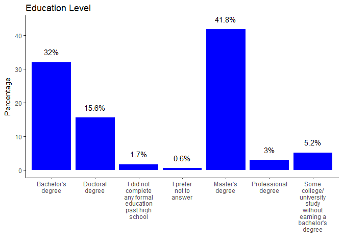
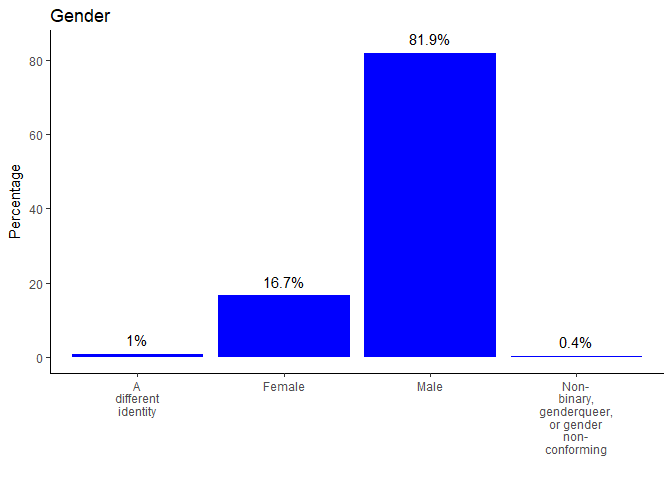
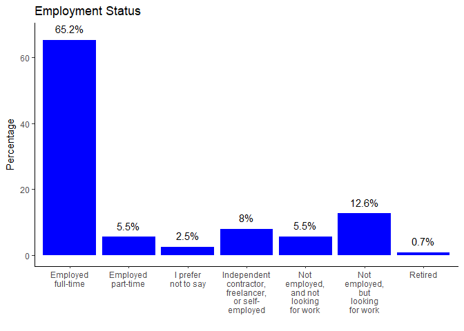
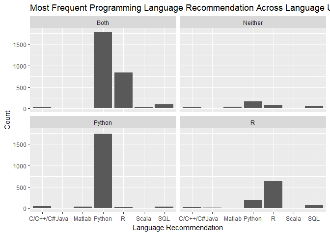
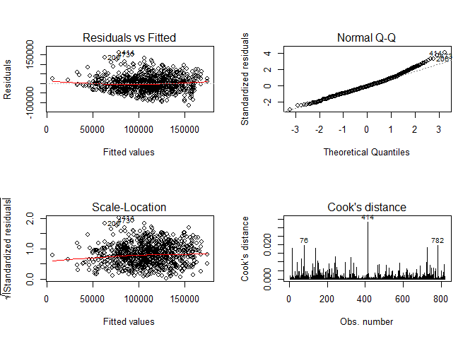

```r
#Load libraries
library(tidyverse)
library(knitr)
library(forcats)
library(randomForest)
library(modelr)
library(pander)
```


```r
#Import data
responses <- read_csv("multipleChoiceResponses.csv")
```

## Demographics


```r
#Create function to plot simple factor/char variables
plot_factor <- function(var, ttl){
  #Create dataset of percentages
  responses <- responses %>%
    filter(!is.na(get(var))) %>%
    group_by(get(var)) %>%
    summarise(n = n()) %>%
    mutate(pct = n/sum(n)*100)
  
  #plot variable
  ggplot(responses, aes(`get(var)`, pct))+
    geom_bar(stat = "identity", fill = "blue")+
    # Include percentages over bars
    geom_text(aes(label = paste0(round(pct,1), "%"), y = pct+2.0),vjust= -.1)+
    theme_classic()+
    scale_x_discrete(labels = function(x) str_wrap(x, width = 10))+
    labs(x = "", y = "Percentage", title = ttl)
    
}

# Create vector of variables of interest to iterate over
kaggle_vars <- c("FormalEducation", "GenderSelect", "EmploymentStatus")
# Vector of custom plot titles
kaggle_titles <- c("Education Level", "Gender", "Employment Status")

# Use map to iterate function over all variables of interest
map2(kaggle_vars, kaggle_titles, plot_factor)
```

```
## [[1]]
```

<!-- -->

```
## 
## [[2]]
```

<!-- -->

```
## 
## [[3]]
```

<!-- -->


## What are the most fequently used data science tools?

```r
#Separate tools used by each participant by comma & unnest to create df of all occurences of each data science tool
tools <- responses  %>% 
    select(WorkToolsSelect) %>%
    mutate(work_tools = strsplit(WorkToolsSelect, ",")) %>%
    unnest(work_tools)
```


```r
#Create data frame of counts of each data science tool
tool_count <- tools %>%
  filter(!is.na(work_tools)) %>%
  group_by(work_tools) %>% 
  summarise(n = n()) %>%
  arrange(desc(n))
```


```r
kable(head(tool_count), col.names = c("Program", "Count"))
```


Program                Count
--------------------  ------
Python                  6073
R                       4708
SQL                     4261
Jupyter notebooks       3206
TensorFlow              2256
Amazon Web services     1868

## The R vs. Python Debate


```r
debate_tools <- responses %>%
  filter(!is.na(WorkToolsSelect))

# Creating a new column called language preference which identifies users who use only R, only Python, both, or neither
debate_tools <- debate_tools  %>% 
   mutate(language_preference = case_when(
       grepl("R", WorkToolsSelect) & !grepl("Python", WorkToolsSelect) ~ "R",
       grepl("Python", WorkToolsSelect) & !grepl("R", WorkToolsSelect) ~"Python",
       grepl("Python,R", WorkToolsSelect) ~ "Both",
       !grepl("Python", WorkToolsSelect) & !grepl("R", WorkToolsSelect) ~ "Neither"))
```


```r
# Creating a new data frame
debate_plot <- debate_tools

# Grouping by language preference and calculate number of responses
debate_plot <- debate_plot  %>% 
   group_by(language_preference)  %>% 
    summarise(n = n())  %>% 

# Removing the row for users of "neither"
    filter(language_preference != "Neither")

#Create chracter string indicating n value for plot caption
plot_n <- paste("n =", sum(debate_plot$n))

# Creating a bar chart
ggplot(debate_plot, aes(language_preference, n))+
    geom_bar(stat = "identity")+
    labs(x = "", y = "", title = "Language Preferences Among Data Scientists",
         caption = plot_n)+
    theme_classic()
```

<!-- -->

Most users report using both languages but among those who report using only one, Python holds a clear majority.

## Language Recommendation

```r
# Creating a new data frame
recommendations <- debate_tools

# Grouping by language_preference and then LanguageRecommendationSelect
recommendations <- recommendations  %>% 
  group_by(language_preference, LanguageRecommendationSelect)  %>% 
  summarise(n = n()) %>%    
# Removing empty responses and include the top recommendations
  filter(!LanguageRecommendationSelect =="NA" & !language_preference =="NA") %>%
  arrange(desc(n)) %>%
  mutate(row = row_number()) %>%
  filter(row <= 5)
```


```r
# Creating a faceted bar plot
ggplot(recommendations, aes(LanguageRecommendationSelect, n)) +
  geom_bar(stat = "identity") +
  facet_wrap(~language_preference)+
  labs(x = "Language Recommendation", y = "Count",
       title = 
    "Most Frequent Programming Language Recommendation Across Language Users")
```

<!-- -->

Even persons who use neither R or Python appear more likely to recommend Python than R. Also interesting to note is the fact that a greater proportion of R users recommended Python compared to Python users who recommended R.


## Predicting Salaries in Data Science

How accurately can we predict how much a person working in data science is paid? We'll select some variables of interest to look at. Age is excluded because it's likely to be related to Tenure (number of years working in data science) and we want to avoid collinearity . We're going to focus on full-time employees and salaries in USD.


```r
# Prep data
model_data <- responses %>%
  
  # Inlcude only full-time workers paid in USD
  filter(CompensationCurrency == "USD",
         EmploymentStatus == "Employed full-time") %>%
  
  select(CompensationAmount, FormalEducation, GenderSelect,
         MajorSelect, WorkDatasetSize, Tenure, EmployerIndustry,
         EmployerSize, JobFunctionSelect) %>%
  
  # Change char variables to numeric and factor
  mutate(CompensationAmount = as.numeric(CompensationAmount)) %>%
  mutate_each(funs(as.factor), FormalEducation, GenderSelect, MajorSelect,
              Tenure, EmployerIndustry, EmployerSize, JobFunctionSelect) %>%
  
  # Remove extraneous or inaccurate responses
  filter(CompensationAmount < 250000 & CompensationAmount > 15000,
         Tenure != "I don't write code to analyze data",
         EmployerSize != "I don't know",
         FormalEducation != "I prefer not to answer") %>%
  
  # Relevel ordered factors
  mutate(Tenure = relevel(Tenure, ref = "Less than a year"),
         FormalEducation = factor(FormalEducation, levels = c("I did not complete any formal education past high school","Some college/university study without earning a bachelor's degree", "Bachelor\'s degree", "Professional degree", "Master\'s degree", "Doctoral degree"))) %>%
  na.omit()
```

### Using Stepwise Selection to find the best variables


```r
#Stepwise selection of best model variables
#Fit model with all variables
fit <- lm(CompensationAmount ~., data=model_data)
#Stepwise selection of variables and interactions, always including education
step <- MASS::stepAIC(fit,
                      scope = list(lower = ~ FormalEducation, upper = ~.^2),
                      trace = FALSE)
step$anova # display results
```

```
## Stepwise Model Path 
## Analysis of Deviance Table
## 
## Initial Model:
## CompensationAmount ~ FormalEducation + GenderSelect + MajorSelect + 
##     WorkDatasetSize + Tenure + EmployerIndustry + EmployerSize + 
##     JobFunctionSelect
## 
## Final Model:
## CompensationAmount ~ FormalEducation + MajorSelect + Tenure + 
##     EmployerIndustry + JobFunctionSelect
## 
## 
##                Step Df    Deviance Resid. Df   Resid. Dev      AIC
## 1                                        757 1.293256e+12 17514.86
## 2 - WorkDatasetSize 12 11950974268       769 1.305207e+12 17498.41
## 3    - EmployerSize  8 19772481380       777 1.324980e+12 17494.76
## 4    - GenderSelect  3  4560765118       780 1.329540e+12 17491.58
```

### Building our model

```r
#Construct model based on stepwise selection results
final_model <- lm(CompensationAmount ~
                    FormalEducation + MajorSelect + Tenure + EmployerIndustry + 
                    JobFunctionSelect,
                  data = model_data)
```

The model has an adjusted R-squared of 0.30 and and p < 0.001.

### Checking assumptions

```r
#Check diagnostic plots
par(mfrow=c(2,2))
plot(final_model, which = 1:4)
```

<!-- -->

There are some outliers with high or low salaries leading to spikes in Cook's distance, but nothing that looks like an error.

### Running a random forest model


```r
set.seed(1313)

#Split data
responses_split <- resample_partition(model_data, c(train = 0.7, test = 0.3))

#Train model
kaggle_model <- randomForest(CompensationAmount ~ 
                               FormalEducation + MajorSelect + Tenure + 
                               EmployerIndustry + JobFunctionSelect,
                             data = responses_split$train)

#Test model
mae(kaggle_model, responses_split$test)
```

```
## [1] 32265.15
```

This model has an average error of about $33,000. Is this model great? Probably not. But it may have some use. Given the amount of fators infuencing job salary, predicting this in the area of of twenty to thirty thousand dollars might be the best one could hope for. Experimenting with more variables, and including observations from other countries could potentially improve prediction accuracy.


```r
devtools::session_info()
```

```
##  setting  value                       
##  version  R version 3.4.3 (2017-11-30)
##  system   x86_64, mingw32             
##  ui       RTerm                       
##  language (EN)                        
##  collate  English_United States.1252  
##  tz       America/New_York            
##  date     2018-09-11                  
## 
##  package      * version date       source        
##  assertthat     0.2.0   2017-04-11 CRAN (R 3.4.3)
##  backports      1.1.2   2017-12-13 CRAN (R 3.4.3)
##  base         * 3.4.3   2017-12-06 local         
##  bindr          0.1     2016-11-13 CRAN (R 3.4.3)
##  bindrcpp     * 0.2     2017-06-17 CRAN (R 3.4.3)
##  broom          0.4.3   2017-11-20 CRAN (R 3.4.3)
##  cellranger     1.1.0   2016-07-27 CRAN (R 3.4.3)
##  cli            1.0.0   2017-11-05 CRAN (R 3.4.3)
##  colorspace     1.3-2   2016-12-14 CRAN (R 3.4.3)
##  compiler       3.4.3   2017-12-06 local         
##  crayon         1.3.4   2017-09-16 CRAN (R 3.4.3)
##  datasets     * 3.4.3   2017-12-06 local         
##  devtools       1.13.5  2018-02-18 CRAN (R 3.4.3)
##  digest         0.6.13  2017-12-14 CRAN (R 3.4.3)
##  dplyr        * 0.7.4   2017-09-28 CRAN (R 3.4.3)
##  evaluate       0.10.1  2017-06-24 CRAN (R 3.4.3)
##  forcats      * 0.2.0   2017-01-23 CRAN (R 3.4.3)
##  foreign        0.8-69  2017-06-22 CRAN (R 3.4.3)
##  ggplot2      * 2.2.1   2016-12-30 CRAN (R 3.4.3)
##  glue           1.2.0   2017-10-29 CRAN (R 3.4.3)
##  graphics     * 3.4.3   2017-12-06 local         
##  grDevices    * 3.4.3   2017-12-06 local         
##  grid           3.4.3   2017-12-06 local         
##  gtable         0.2.0   2016-02-26 CRAN (R 3.4.3)
##  haven          1.1.0   2017-07-09 CRAN (R 3.4.3)
##  highr          0.6     2016-05-09 CRAN (R 3.4.3)
##  hms            0.4.0   2017-11-23 CRAN (R 3.4.3)
##  htmltools      0.3.6   2017-04-28 CRAN (R 3.4.3)
##  httr           1.3.1   2017-08-20 CRAN (R 3.4.3)
##  jsonlite       1.5     2017-06-01 CRAN (R 3.4.3)
##  knitr        * 1.19    2018-01-29 CRAN (R 3.4.3)
##  labeling       0.3     2014-08-23 CRAN (R 3.4.1)
##  lattice        0.20-35 2017-03-25 CRAN (R 3.4.3)
##  lazyeval       0.2.1   2017-10-29 CRAN (R 3.4.3)
##  lubridate      1.7.1   2017-11-03 CRAN (R 3.4.3)
##  magrittr       1.5     2014-11-22 CRAN (R 3.4.3)
##  MASS           7.3-47  2017-02-26 CRAN (R 3.4.3)
##  memoise        1.1.0   2017-04-21 CRAN (R 3.4.3)
##  methods      * 3.4.3   2017-12-06 local         
##  mnormt         1.5-5   2016-10-15 CRAN (R 3.4.1)
##  modelr       * 0.1.1   2017-07-24 CRAN (R 3.4.3)
##  munsell        0.4.3   2016-02-13 CRAN (R 3.4.3)
##  nlme           3.1-131 2017-02-06 CRAN (R 3.4.3)
##  pander       * 0.6.2   2018-07-08 CRAN (R 3.4.4)
##  parallel       3.4.3   2017-12-06 local         
##  pkgconfig      2.0.1   2017-03-21 CRAN (R 3.4.3)
##  plyr           1.8.4   2016-06-08 CRAN (R 3.4.3)
##  psych          1.7.8   2017-09-09 CRAN (R 3.4.3)
##  purrr        * 0.2.4   2017-10-18 CRAN (R 3.4.3)
##  R6             2.2.2   2017-06-17 CRAN (R 3.4.3)
##  randomForest * 4.6-14  2018-03-25 CRAN (R 3.4.4)
##  Rcpp           0.12.14 2017-11-23 CRAN (R 3.4.3)
##  readr        * 1.1.1   2017-05-16 CRAN (R 3.4.3)
##  readxl         1.0.0   2017-04-18 CRAN (R 3.4.3)
##  reshape2       1.4.3   2017-12-11 CRAN (R 3.4.3)
##  rlang          0.1.4   2017-11-05 CRAN (R 3.4.3)
##  rmarkdown      1.8     2017-11-17 CRAN (R 3.4.3)
##  rprojroot      1.3-1   2017-12-18 CRAN (R 3.4.3)
##  rstudioapi     0.7     2017-09-07 CRAN (R 3.4.3)
##  rvest          0.3.2   2016-06-17 CRAN (R 3.4.3)
##  scales         0.5.0   2017-08-24 CRAN (R 3.4.3)
##  stats        * 3.4.3   2017-12-06 local         
##  stringi        1.1.6   2017-11-17 CRAN (R 3.4.2)
##  stringr      * 1.2.0   2017-02-18 CRAN (R 3.4.3)
##  tibble       * 1.3.4   2017-08-22 CRAN (R 3.4.3)
##  tidyr        * 0.7.2   2017-10-16 CRAN (R 3.4.3)
##  tidyverse    * 1.2.1   2017-11-14 CRAN (R 3.4.3)
##  tools          3.4.3   2017-12-06 local         
##  utils        * 3.4.3   2017-12-06 local         
##  withr          2.1.2   2018-03-15 CRAN (R 3.4.4)
##  xml2           1.1.1   2017-01-24 CRAN (R 3.4.3)
##  yaml           2.1.16  2017-12-12 CRAN (R 3.4.3)
```


